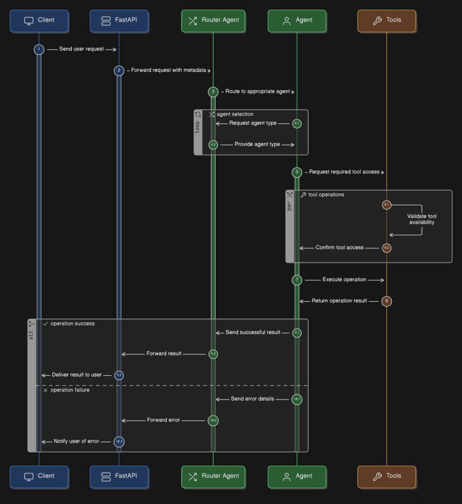

A production-ready multi-agent system with intelligent routing, real-time data fetching, and comprehensive API integration. Built with LangChain, LangGraph, and FastAPI for enterprise-grade AI orchestration

✨ Features

🤖 Intelligent Agent Orchestration

Router Pattern: AI-powered query routing using LangGraph state machines

Specialized Agents: Weather, News, and Finance agents with domain expertise

Parallel Execution: Concurrent agent processing for complex queries

Memory Management: Persistent conversation context across sessions

  🔌 Real Data Integration
Weather Data: Real-time forecasts from OpenWeather API

News Updates: Latest headlines from NewsAPI + web scraping fallbacks

Financial Markets: Stock prices, crypto rates, forex from multiple sources

Fallback Systems: Graceful degradation when primary APIs fail
                              

  🏗️ Enterprise Architecture

  Production API: Fully documented REST API with FastAPI

  Async Processing: High-performance async/await patterns throughout

  Rate Limiting: API key-based rate limiting and authentication

  Comprehensive Logging: Structured logging with request tracing

  📊 Observability & Monitoring

  Health Checks: System status and agent availability monitoring

  Performance Metrics: Response time, cache hit rates, error tracking

  Request Tracing: End-to-end request lifecycle tracking

  API Documentation: Interactive Swagger/OpenAPI documentation

 🚀 Quick Start

  Python 3.11+

  OpenAI API Key

  (Optional) API keys for enhanced services

  INSTALLATION
  # Clone the repository
git clone https://github.com/lemessaA/multi-agent-system.git
cd multi-agent-system

# Create virtual environment
python -m venv venv

# Activate virtual environment
# On macOS/Linux:
source venv/bin/activate
# On Windows:
venv\Scripts\activate

# Install dependencies
pip install -r requirements.txt

# Configure environment
cp .env.example .env
# Edit .env with your API keys

  ENVIRONMENT CONFIGURATON
# Required
OPENAI_API_KEY=sk-your-openai-api-key-here

# Optional (for enhanced functionality)
OPENWEATHER_API_KEY=your_openweather_api_key
NEWS_API_KEY=your_newsapi_key
ALPHA_VANTAGE_API_KEY=your_alphavantage_key

  RUNNING THE SYSTEM  
# Development mode with hot reload
python main.py

# Or run directly with uvicorn
uvicorn api.app:app --reload --host 0.0.0.0 --port 8000

                    
  VERIFY INSTALLATION

# Check API health
curl http://localhost:8000/health

# List available agents
curl http://localhost:8000/agents

  🎯 Usage Examples

Auto-Routing Query

curl -X POST "http://localhost:8000/query" \
  -H "Content-Type: application/json" \
  -d '{
    "query": "What is the weather in Tokyo and show me the latest tech news?",
    "parameters": {
      "location": "Tokyo",
      "category": "technology"
    }
  }'

 Direct Agent Query

# Weather Agent
curl -X POST "http://localhost:8000/query/weather" \
  -H "Content-Type: application/json" \
  -d '{"query": "3-day forecast for London"}'

# News Agent  
curl -X POST "http://localhost:8000/query/news" \
  -H "Content-Type: application/json" \
  -d '{"query": "Top business headlines in the US"}'

# Finance Agent
curl -X POST "http://localhost:8000/query/finance" \
  -H "Content-Type: application/json" \
  -d '{"query": "Current price of AAPL and Bitcoin"}'
 

  Python Client Example

import httpx
import asyncio

async def query_agent(query: str, agent_type: str = None):
    url = "http://localhost:8000/query"
    if agent_type:
        url = f"http://localhost:8000/query/{agent_type}"
    
async with httpx.AsyncClient() as client:
  response = await client.post(
      url,
      json={"query": query},
      timeout=30.0
  )
  return response.json()

# Example usage
result = asyncio.run(query_agent("Weather in Paris", "weather"))
print(result)

  🏗️ Architecture Overview
            
  

            

  PROJECT STRUCTURE 

            multi-agent-system/
├── agents/              # Agent implementations
│   ├── base_agent.py   # Base agent class
│   ├── weather_agent.py
│   ├── news_agent.py
│   ├── finance_agent.py
│   └── router_agent.py # LangGraph router
├── tools/              # External API integrations
│   ├── weather_tools.py
│   ├── news_tools.py
│   └── finance_tools.py
├── api/                # FastAPI application
│   └── app.py         # API endpoints
├── config/            # Configuration
│   └── settings.py
├── schemas/           # Pydantic models
│   └── models.py
└── tests/             # Test suite

📊 Performance & Scaling
Caching Strategy
Agent Responses: 60-second TTL

Weather Data: 5-minute TTL

News Headlines: 2-minute TTL

Stock Prices: 30-second TTL

Rate Limiting

Default: 100 requests/minute per API key

Burst capacity: 20 requests/second

Customizable per agent/endpoint

📈 Monitoring & Logging

# Logging configuration
logging.basicConfig(
    level=logging.INFO,
    format='%(asctime)s - %(name)s - %(levelname)s - %(message)s',
    handlers=[
        logging.FileHandler('logs/app.log'),
        logging.StreamHandler()
    ]
)

# Key metrics tracked:
# - Request/response times
# - Agent execution times
# - Cache hit rates
# - API error rates
# - Token usage

